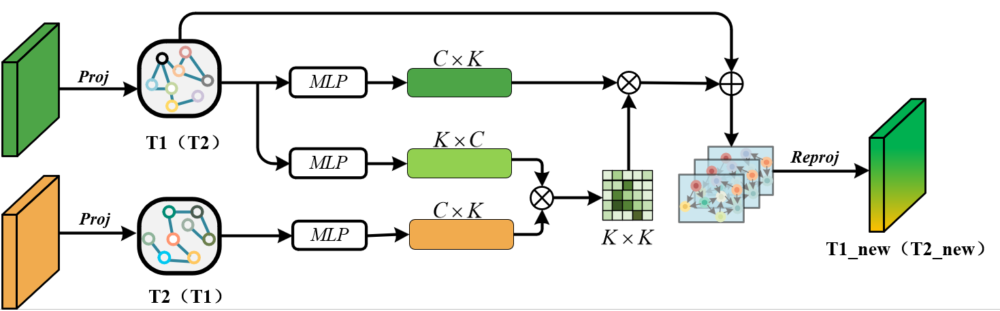

# [MISGNet: Multilevel Intertemporal Semantic Guidance Network for Remote Sensing Images Change Detection](https://ieeexplore.ieee.org/document/10771701)

**Authors:** [Binge Cui](https://ieeexplore.ieee.org/author/37086379809), [Chenglong Liu](https://ieeexplore.ieee.org/author/37088488229), [Haojie Li](https://ieeexplore.ieee.org/author/37539774600), [Jianzhi Yu](https://ieeexplore.ieee.org/author/37088352219)

We are excited to provide the PyTorch implementation of the paper: **MISGNet: Multilevel Intertemporal Semantic Guidance Network for Remote Sensing Images Change Detection**.

# 🛎️Updates

**🎉 Exciting News! 🎉**
Nov. 26th, 2024，We are thrilled to announce that **MISGNet** has been accepted for publication in **IEEE JSTARS**! 🎉 You can check it out [here](https://ieeexplore.ieee.org/document/10771701).

If you find the project interesting, please consider giving it a ⭐️ **star** ⭐️ to support us! Stay tuned for more updates! 🔥

## 🔭Overview


## 🌟Semantics Guidance Module (SGM)




## 🌟Multilevel Difference Aggregation Module


## **📝** Requirements

To run this project, you need to install the following dependencies:

```bash
albumentations>=1.3.0
numpy>=1.20.2
opencv_python>=4.7.0.72
opencv_python_headless>=4.7.0.72
Pillow>=9.4.0
Pillow>=9.5.0
scikit_learn>=1.0.2
torch>=1.9.0
torchvision>=0.10.0
```


## 🛠️ **Installation**

To clone this repository and get started, use the following commands:

```bash
git clone https://github.com/JackLiu-97/MISGNet.git
cd MISGNet
```


## 🗝️Quick Start

### 1. **Download Pretrained Models**

You can download the pretrained models for the following datasets:

- **LEVIR-CD**: [Baidu Drive, code: itrs](https://pan.baidu.com/s/1kGupH6yMj_Qj_sIqDRhK6Q)
- **SYSU-CD**: [Baidu Drive, code: itrs](https://pan.baidu.com/s/1aSrkl--vdaPVaiMCviHrjQ)

After downloading, place the model in the `output` folder.

### 2. **Run the Demo**

Once the model is in place, you can run the demo to get started:

```bash
python demo.py --ckpt_url ${model_path} --data_path ${sample_data_path} --out_path ${out_data_path}
```


## 🚀 **Training**

To train a model from scratch, run the following command:

```bash
python train.py --data_path ${train_data_path} --val_path ${val_data_path} --lr ${lr} --batch_size ${batch_size}
```


## 🔍 **Evaluation**

To evaluate a model on the test subset, use:

```bash
python predict.py --ckpt_url ${model_path} --data_path ${test_data_path}
```


## ⚗️Result

We have also provided inference results for easier comparison with our model:

- **LEVIR-CD**: [Baidu Drive, code: itrs](https://pan.baidu.com/s/1VWne8aNe8t6jqvy5_q6_dQ)
- **SYSU-CD**: [Baidu Drive, code: itrs](https://pan.baidu.com/s/1Ch1mJeROe8cx48JTLMb8jw)


## 📚 **Supported Datasets**

**WHU-CD**: The WHU Building Change Detection Dataset contains two aerial images taken at different time phases, with significant land-use changes over a $20.5km^2$ area.

- **Size**: $32570\times15354$
- **Resolution**: $0.2m$
- **Train/Validation/Test Split**: $6096/762/762$

**LEVIR-CD**: Consists of $637$ very high-resolution ($0.5$m/pixel) Google Earth image patch pairs.

- **Size**: $1024\times1024$ pixels
- **Time Span**: 5-14 years
- Contains 31,333 individual change building instances.

**SYSU-CD**: Contains $20000$ pairs of $0.5$m aerial images from Hong Kong, covering changes such as new urban buildings, suburban expansion, groundwork, vegetation change, road expansion, and sea construction.

- **Image Size**: $256\times256$

|                  Dataset                   |    Name    |                             Link                             |
| :----------------------------------------: | :--------: | :----------------------------------------------------------: |
| LEVIR-CD building change detection dataset | `LEVIR-CD` |             [website](http://chenhao.in/LEVIR/)              |
| SYSU-CD building change detection dataset  | `SYSU-CD`  |        [website](https://github.com/liumency/SYSU-CD)        |
|   WHU building change detection dataset    |  `WHU-CD`  | [website](http://study.rsgis.whu.edu.cn/pages/download/building_dataset.html) |


## 📄 **License**

The code is released for **non-commercial** and **research purposes only**. For commercial use, please contact the authors.
